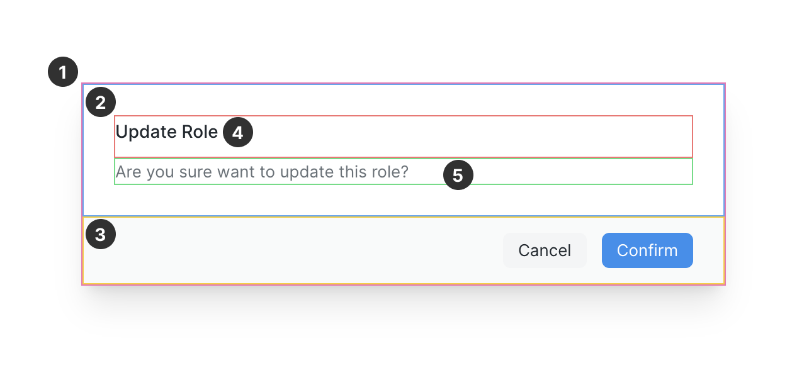

<script setup>
import { ref } from 'vue'
import { Dialog, Button } from '../../src/index'
let optionsDialog = ref(false)
let slotsDialog = ref(false)
let bodyDialog = ref(false)
let log = console.log
let asyncJob = () => new Promise(resolve => setTimeout(resolve, 1000))
</script>

# Dialog

The Dialog is a component that is rendered over the page with an overlay. It is
used to show messages or actions when user's attention is needed.

## Usage (props)

The `options` prop allows you set a number of options for a standard Dialog
layout.

<Story>
  <Button @click="optionsDialog = true">Show Dialog</Button>
  <Dialog
    v-model="optionsDialog"
    :options="{
      title: 'Update Role',
      message: 'Are you sure want to update this role?',
    //   icon: {
    //     name: 'alert-triangle',
    //     appearance: 'warning',
    //   },
    //   size: 'sm',
      actions: [
        {
          label: 'Confirm',
          appearance: 'primary',
          handler: ({ close }) => {
            // do action
            close() //
          },
        },
        // actions without a handler will automatically close the dialog
        { label: 'Cancel' },
      ],
    }"
  />
</Story>

```vue
<template>
  <Button @click="showDialog = true">Show Dialog</Button>
  <Dialog
    :options="{
      title: 'Update Role',
      message: 'Are you sure want to update this role?',
      icon: {
        name: 'alert-triangle',
        appearance: 'warning',
      },
      size: 'sm',
      actions: [
        {
          label: 'Confirm',
          appearance: 'primary',
          handler: ({ close }) => {
            // updateRole()
            close() // closes dialog
          },
        },
        { label: 'Cancel' },
      ],
    }"
    v-model="showDialog"
  />
</template>

<script setup>
import { ref } from 'vue'
import { Dialog, Button } from 'frappe-ui'
let showDialog = ref(false)
</script>
```

## Props

There is only one prop `option` which is an Object. Each of the properties of
this object is described in the table below.

| Name                      | Default            | Value                                                                  | Description                                                                                                                    |
| :------------------------ | :----------------- | :--------------------------------------------------------------------- | :----------------------------------------------------------------------------------------------------------------------------- |
| `options.title`           | `Untitled`         | `String`                                                               | Title of the dialog                                                                                                            |
| `options.message`         | `null`             | `String`                                                               | Message shown in the body of the dialog                                                                                        |
| `options.icon`            | `String \| Object` | [FeatherIcon](./feathericon) name or `Object{name, appearance}`        | Icon shown to the left of title                                                                                                |
| `options.icon.name`       | `String`           | [FeatherIcon](./feathericon) name                                      |                                                                                                                                |
| `options.icon.appearance` | `null`             | `warning \| info \| danger \| success`                                 | Changes the color of icon                                                                                                      |
| `options.size`            | `'lg'`             | `xs \| sm \| md \| lg \| xl \| 2xl \| 3xl \| 4xl \| 5xl \| 6xl \| 7xl` | Change the width of the dialog                                                                                                 |
| `options.actions`         | `null`             | Array of [Button](./button) props                                      | Each object in the array must be an object of props passed to a Button component. Click handler is set via `handler` property. |

## Usage (slots)

If you want to take control over the markup of each part of the dialog, you can
use slots. The Dialog components is made up of nested slots which allows you to
override a part in a granular way.



Here are the slot names corresponding to the marked region in the above
screenshot:

| Number | Name           | Description                          |
| :----- | :------------- | :----------------------------------- |
| 1      | `body`         | Override the full body of the dialog |
| 2      | `body-main`    | Override the main content            |
| 3      | `actions`      | Override the actions                 |
| 4      | `body-title`   | Override the title                   |
| 5      | `body-content` | Override the message                 |

In the following example, the slots `body-title` and `body-content` are used.
Notice that we can still use `options.actions` to show our action buttons.

<Story>
  <Button @click="slotsDialog = true">Show Dialog</Button>
  <Dialog
   :options="{
      actions: [
        { label: 'Destroy', appearance: 'danger' },
        { label: 'Cancel' },
      ],
   }"
   v-model="slotsDialog"
  >
    <template #body-title>
      <h2 class="text-3xl font-bold">My custom title</h2>
    </template>
    <template #body-content>
      <p class="mt-4 text-lg">
        Irure Lorem culpa nulla fugiat nulla labore aliquip exercitation laboris
        ex qui. Aliquip pariatur esse amet laboris. Veniam ullamco dolore
        incididunt consequat commodo id consectetur labore et. Eiusmod esse
        laborum irure aliquip laboris sunt dolore voluptate sint ea mollit do
        Lorem. Sit aute dolore aliqua id Lorem amet eu anim pariatur nostrud
        quis ut. Officia in aliquip minim id esse do. Magna in enim commodo
        tempor nisi voluptate cupidatat reprehenderit.
      </p>
    </template>
  </Dialog>
</Story>

```vue
<template>
  <Button @click="slotsDialog = true">Show Dialog</Button>
  <Dialog
    :options="{
      actions: [
        { label: 'Destroy', appearance: 'danger' },
        { label: 'Cancel' },
      ],
    }"
    v-model="slotsDialog"
  >
    <template #body-title>
      <h2 class="text-3xl font-bold">My custom title</h2>
    </template>
    <template #body-content>
      <p class="mt-4 text-lg">
        Irure Lorem culpa nulla fugiat nulla labore aliquip exercitation laboris
        ex qui. Aliquip pariatur esse amet laboris. Veniam ullamco dolore
        incididunt consequat commodo id consectetur labore et. Eiusmod esse
        laborum irure aliquip laboris sunt dolore voluptate sint ea mollit do
        Lorem. Sit aute dolore aliqua id Lorem amet eu anim pariatur nostrud
        quis ut. Officia in aliquip minim id esse do. Magna in enim commodo
        tempor nisi voluptate cupidatat reprehenderit.
      </p>
    </template>
  </Dialog>
</template>
```

In the following example, we have used the `body` slot. This is top-most slot
and overrides everything. Use it for fully custom dialog layouts.

<Story>
  <Button @click="bodyDialog = true">Show Dialog</Button>
  <Dialog v-model="bodyDialog">
    <template #body>
      <div
        class="flex items-center justify-between border-t p-2"
        v-for="i in 4"
        :key="i"
      >
        <span>Item {{ i }}</span>
        <Button icon="x" />
      </div>
    </template>
  </Dialog>
</Story>

```vue
<template>
  <Button @click="bodyDialog = true">Show Dialog</Button>
  <Dialog v-model="bodyDialog">
    <template #body>
      <div
        class="flex items-center justify-between border-t p-2"
        v-for="i in 4"
        :key="i"
      >
        <span>Item {{ i }}</span>
        <Button icon="x" />
      </div>
    </template>
  </Dialog>
</template>
```
