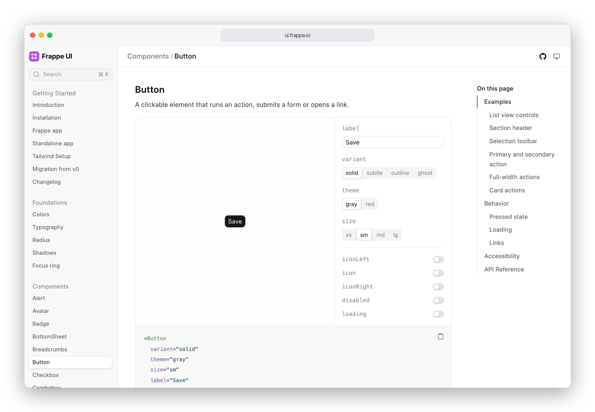

<div align="center" markdown="1">


# Frappe UI

**Vue 3 components, design tokens and data composables for Frappe apps**

<a href="https://www.npmjs.com/package/frappe-ui"></a>
<a href="https://www.npmjs.com/package/frappe-ui"></a>
<a href="./license.md"></a>

<a href="https://ui.frappe.io">

</a>

[Documentation](https://ui.frappe.io) ·
[Getting started](https://ui.frappe.io/docs/getting-started) ·
[Migration guide](https://ui.frappe.io/docs/migration) ·
[Changelog](https://ui.frappe.io/docs/changelog)

</div>

## What you get

- **50+ components.** Buttons, form controls, dialogs, popovers, tabs, sidebars,
  app shells and more. Built with [Vue 3](https://vuejs.org),
  [Tailwind CSS](https://tailwindcss.com) and [Reka UI](https://reka-ui.com)
  primitives.
- **Design tokens with dark mode built in.** Semantic `surface`, `ink` and
  `outline` color tokens, plus radius, typography and elevation scales. Tokens
  flip under `[data-theme="dark"]`, so a `dark:` variant is never needed.
- **Data composables for Frappe.** `useCall`, `useList`, `useDoc`, `useDoctype`
  and `useNewDoc` handle fetching, caching, pagination and writes against a
  Frappe backend.
- **Rich text editor, lists and charts** as separate entries: `frappe-ui/editor`
  (TipTap), `frappe-ui/list` and `frappe-ui/charts` (ECharts).
- **Vite plugins** for the Frappe dev-server proxy, Lucide icon auto-imports,
  DocType type generation and production builds.
- **TypeScript first.** Every core component ships typed props, slots and emits.
- **Recipes.** Eight full app screens built with frappe-ui, such as mail,
  tickets, deals and accounting, each with a desktop and a mobile layout. See
  them on the [home page](https://ui.frappe.io).
- **Agent skills.** An [agent skill](./skills/frappe-ui/) and
  [llms.txt](https://ui.frappe.io/llms.txt) teach Claude Code, Cursor, Codex
  and similar tools how to use the library. See
  [Using with AI agents](#using-with-ai-agents).

## Quick start

Requires **Node `>=20.19.0`**, **Vite**, **Vue `>=3.5`** and **Tailwind CSS
`>=3.4 <4`**.

```sh
npm install frappe-ui
```

Add the Vite plugin in `vite.config.js`:

```js
import { defineConfig } from 'vite'
import vue from '@vitejs/plugin-vue'
import frappeui from 'frappe-ui/vite'

export default defineConfig({
  plugins: [frappeui(), vue()],
})
```

Add the preset and content globs in `tailwind.config.js`:

```js
import preset, { content } from 'frappe-ui/tailwind'

export default {
  presets: [preset],
  content: [...content, './index.html', './src/**/*.{vue,js,ts}'],
}
```

Import the stylesheet once from your CSS entry:

```css
@import 'frappe-ui/style.css';
```

Wrap your app root in `FrappeUIProvider` and start using components:

```vue
<script setup>
import { FrappeUIProvider, Button, useList } from 'frappe-ui'

const todos = useList({
  doctype: 'ToDo',
  fields: ['name', 'description'],
  filters: { status: 'Open' },
})
</script>

<template>
  <FrappeUIProvider>
    <ul>
      <li v-for="todo in todos.data" :key="todo.name">
        {{ todo.description }}
      </li>
    </ul>
    <Button variant="solid" icon-left="lucide-plus" @click="todos.next()">
      Load more
    </Button>
  </FrappeUIProvider>
</template>
```

The full setup, including the starter template and TypeScript, is on the
[Installation](https://ui.frappe.io/docs/getting-started) page. The
[Frappe app](https://ui.frappe.io/docs/getting-started/frappe) guide covers the
dev-server proxy.

## Package entries

| Import                  | Contents                                                               |
| ----------------------- | ---------------------------------------------------------------------- |
| `frappe-ui`             | Core components, data composables, `dialog` and `toast`, directives    |
| `frappe-ui/editor`      | TipTap-based rich text editor, kits and extensions                     |
| `frappe-ui/code-editor` | CodeMirror-based code editor and `CodeKit`                             |
| `frappe-ui/list`        | Composable `List` family: rows, cells, headers, groups, sorting        |
| `frappe-ui/charts`      | ECharts-based area, bar, line, donut, funnel, heatmap, sankey, scatter |
| `frappe-ui/icons`       | Frappe's own icons, such as `StepsIcon` and `LightningIcon`            |
| `frappe-ui/vite`        | Vite plugins                                                           |
| `frappe-ui/tailwind`    | Tailwind preset and content globs                                      |
| `frappe-ui/style.css`   | Base stylesheet, fonts and token variables                             |

## Using with AI agents

Install the frappe-ui skill in your coding agent:

```sh
npx skills add https://github.com/frappe/frappe-ui/tree/main/skills/frappe-ui
```

Or point it to [ui.frappe.io/llms.txt](https://ui.frappe.io/llms.txt), a list
of every docs page.

## Contributing

```sh
yarn                # install
yarn dev            # component playground
yarn docs:dev       # documentation site
yarn test           # vitest
yarn type-check     # vue-tsc
```

Before you change a public API, read [`PHILOSOPHY.md`](./PHILOSOPHY.md) for the
design rules, [`CONTEXT.md`](./CONTEXT.md) for the shared vocabulary and
[`spec/`](./spec/) for component contracts and decision records.

## Used by

- [Frappe Cloud](https://frappe.io/cloud)
- [Frappe CRM](https://github.com/frappe/crm)
- [Helpdesk](https://github.com/frappe/helpdesk)
- [Frappe HR](https://github.com/frappe/hrms)
- [Frappe Learning](https://github.com/frappe/lms)
- [Insights](https://github.com/frappe/insights)
- [Builder](https://github.com/frappe/builder)
- [Gameplan](https://github.com/frappe/gameplan)

## License

[MIT](./license.md)

<br>
<div align="center">
	<a href="https://frappe.io" target="_blank">
		<picture>
			<source media="(prefers-color-scheme: dark)" srcset="https://frappe.io/files/Frappe-white.png">
			
		</picture>
	</a>
</div>
