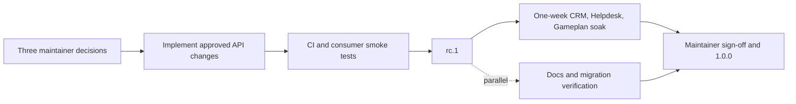

# RC decision brief

Hosted review: https://frappe-ui-v1-decisions.netchamp-faris.chatgpt.site

The hosted document includes the confirmed List API and List/Table scope boundary.

Reviewed 2026-09-09 against `main` at `db3b5305626a3f33789612111d0534c65961e13f`, version `1.0.0-beta.61`.

The GitHub inventory contains 111 open issues and 32 open PRs. This brief reviews release scope and API contracts, not merge readiness.

The live dependency list for [RC #1029](https://github.com/frappe/frappe-ui/issues/1029) has exactly three open blockers: #1116, #1117, and #1118. Nine earlier blockers are closed. The maintainer's latest comment confirms this scope. Older issue bodies and `plan.md` contain superseded instructions.

D1, D2, D3 typography and color, List, and the 1.1 scope cut record confirmed maintainer decisions.

The user assigned charts to Saqib. Charts API decisions leave this interview queue; RC inclusion and merge readiness are not inferred. Hosted version 7 includes all confirmed decisions, including label and description color, the 1.1 scope cut, charts ownership, and implementation handoff.

## Decisions required for RC

| ID | Decision | Recommendation | Implementation after the decision |
| --- | --- | --- | --- |
| D1 · confirmed | Names and component boundaries [#1116](https://github.com/frappe/frappe-ui/issues/1116) | Rename `Rail` to `SidebarRail` and `RailItem` to `SidebarRailItem`. Group them with the Sidebar family, independently composable beside `Sidebar` and usable alone. Keep `PageHeader`, `Duration`, `TimePicker`, typed `Divider.action`, and the renderless `Editor`. | Rename the rail family consistently across components, exported types, documentation, examples, and consumers. Keep existing composition and layout ownership. Correct the parity review's false premises and record the retained contracts. |
| D2 · confirmed | Which input sizes become permanent? [#1117](https://github.com/frappe/frappe-ui/issues/1117) | Use `xs / sm / md / lg`, with single-line heights 24/28/32/40px. Add input `xs` consistently and remove input `xl`. | Update every input and selection size declaration and class map, including FormControl and experimental consumers. Check consumers before removal. Add invalid-value fallback and migration guidance. Keep Progress, toggle, and Slider scales separate. |
| D3 · confirmed | What is the shared form typography contract? [#1118](https://github.com/frappe/frappe-ui/issues/1118) | Fixed 13px labels, descriptions, and Textarea text. Labels and descriptions use `ink-gray-6`. Textarea retains `xs / sm / md / lg` for spacing and minimum height. Remove `FormLabel.size` as the consequence of a fixed label size. | Update both label implementations, Textarea, descriptions, docs, and layout assertions. Set label and description color defaults to `ink-gray-6`. Document removal of `FormLabel.size`. Recheck minimum heights, contrast, and disabled states. |

D2 and removal of `FormLabel.size` carry compatibility costs. The issues' in-repo counts do not establish external usage. Count affected consumers before implementation and escalate if the migration cost changes the premise.

D1 also rejects these unnecessary changes: `Button.icon` is already an icon value, not a boolean; `Spinner` already exists; and `Password` itself uses `TextInput type="password"`.

## Optional contracts to settle before including their PRs

These are not registered RC blockers. Including them should require a specific contract, rather than reopening the entire family.

| Proposal | Contract to accept or revise | Recommendation |
| --- | --- | --- |
| [Charts #1128](https://github.com/frappe/frappe-ui/pull/1128) · owner: Saqib | `tooltipColumns`, tooltip slot `row`, `ChartTooltipItem.kind`, `value: number \| string`, optional `color`, reference-line `labelPlacement`, and token `cellGap` → `backdrop`. | The user confirmed that Saqib handles charts. Leave its API decisions with him. Track RC inclusion and merge readiness separately. The review findings below remain notes, not accepted decisions. |
| [Natural dates #1101](https://github.com/frappe/frappe-ui/pull/1101) | `naturalLanguage` defaults to true; `parseNaturalDate` and `parseNaturalRange` become root exports; `invalid-change` remains undecided. | Confirmed: defer to 1.1. Review helper exports, invalid input behavior, and parser precedence before it ships. |
| [External navigation #1125](https://github.com/frappe/frappe-ui/issues/1125) | Explicit `href` versus URL inference from `to`, for both rail and sidebar items. | Confirmed: defer to 1.1. Future recommendation: explicit `href` for document navigation and `to` for router navigation. Precedence remains a later API decision. |
| [Parity additions #1122](https://github.com/frappe/frappe-ui/issues/1122), [Tag/Notification #1123](https://github.com/frappe/frappe-ui/issues/1123) | New props, slots, variants, and components. | Confirmed: defer the whole batch to 1.1. |

The confirmed scope cut also defers PhoneInput #930, resizable layouts #542, MultiSelect creation #809, and initializer #826 to 1.1. Data-fetching v3 #610 is already outside v1 scope.

Further #1128 review found a tooltip data decision: long-data pivoting carries only configured tooltip columns and selects the first source value per category. The proposed slot `row` is therefore a normalized plotted row, not an arbitrary original record. Recommendation, pending approval: require extra values to be constant within each category and warn on disagreement. If callers need individual source records, review a separate `rows` contract. Also export the proposed `ReferenceLineLabelPlacement` type from the barrel. The names `tooltipColumns`, `row`, `kind`, `labelPlacement`, and `backdrop` remain recommended, not approved.

## Contracts already concrete enough for agents

- [List styling #1097](https://github.com/frappe/frappe-ui/pull/1097): confirmed. List covers composed lists and simple tables. A separate Table API owns resizing and saved column layouts. `columns` accepts either `string[]` or a breakpoint object with required `base`. Each breakpoint replaces the complete track array and applies upward until the next supplied breakpoint. Breakpoints use the consuming app’s responsive definitions. Each nested List owns its configuration. Cell visibility stays explicit in matching header/body classes. CSS variables are an internal rendering mechanism. Revise #1097’s ancestor-inheritance contract. Gap and padding utilities remain separate.
- [Public types #1091](https://github.com/frappe/frappe-ui/pull/1091) and [model emits #1098](https://github.com/frappe/frappe-ui/pull/1098) follow existing component conventions. Finish together before RC if practical. Verify exported type members as well as template inference. #1098 removes model-event keys from two exported interfaces, even though runtime events remain. Its issue names five affected components, but only Combobox and MultiSelect actually combine the duplicate declarations.
- Root versus subpaths, v1 resources versus v2 composables, and the experimental parking policy are already decided. Do not re-run these decisions from the older release plan.

```text
frappe-ui                 stable components, resources, v2 composables
frappe-ui/editor          stable composed editor
frappe-ui/list            stable composed list
frappe-ui/charts          stable chart family
frappe-ui/experimental    parked and evolving components
frappe-ui/vitepress       explicitly unstable docs theme
tailwind / vite tooling   existing names stay; additions allowed
```

## Proposed agent queue

This is a local handoff proposal. No GitHub issues or PRs were changed.

Detailed ticket drafts: [RC implementation handoff](rc-implementation-handoff.md).

| Work | Dependencies and acceptance |
| --- | --- |
| Reconcile the release instructions | Record D1–D3 and optional PR scope. Reconcile #1029, #690, #687–#689, and `plan.md` with current decisions. Remove stale claims that v3 ships or resources are deprecated. |
| Rename the rail family | D1 is confirmed. Use `SidebarRail` and `SidebarRailItem`, and audit related public symbols for consistent names. Keep the rail independently composable beside Sidebar. Verify root exports, consumer imports, documentation, and existing rail behavior. Document the pre-RC migration. |
| Implement the input scale and typography | D2 and D3, including label and description color, are confirmed. One owner should handle input maps, types, stories, and generated API tables. Test actual computed sizes, form labeling, invalid-size fallback, and migration behavior. |
| Finish list styling and public types | List contract is confirmed. Extend columns with the responsive object form and revise #1097. Generate CSS media rules from app breakpoints, reset every internal variable per List, and verify SSR, omitted breakpoints, custom breakpoint values, nested isolation, and explicit visibility. Rebase #1091 and #1098 as needed. Check template inference, exported types, and generated documentation. |
| Charts · owner: Saqib | Follow Saqib’s contract decisions and confirm RC inclusion. Fix #1128's failing Type Check job. Test consumers of tooltip types and token overrides, not only rendered charts. Add explicit breaking-change documentation. |
| Review existing correctness fixes | Reproduce against latest main before adopting old patches. Prioritize #1006 cache isolation, #1105 reconnect subscriptions, #1062 early toasts, and #1089/#1039/#1113 accessible names. These need engineering review, not new naming choices. |
| Consolidate duplicates and stale PRs | Choose between #1048/#1042 for #1034. Check #901/#1049 against the merged Tabs rewrite and #1058. Recheck #906's old file location after the framework move. Supersede #822 against experimental CommandPalette. Do not add these to the RC gate merely because they remain open. |
| Cut and validate RC | Run current CI, docs checks, and consumer smoke tests. Follow #1029's existing soak policy. Use its current dependencies, not the old four-item body. |

The remaining parity work #1119–#1121 does not gate RC. It includes visual choices, so calling every row mechanical would be inaccurate. Recommended later defaults: preserve Dialog action-array order, keep Combobox's existing search modes, and match the existing trailing-check pattern without hover-only suffixes. DatePicker's 196px figure still needs a grid-versus-outer-panel interpretation before that visual ticket runs.

The charts screen-reader check [#1036](https://github.com/frappe/frappe-ui/issues/1036) is explicitly deferred to 1.1 by the latest maintainer comment. Its original body and the map still suggest a pre-freeze gate. Do not block RC on that stale text.



The soak policy is already decided in #1029. An API break requires rc.2 and restarts the week. Ordinary bug fixes can continue during the soak.

## Verification and workspace state

- Latest-main [Tests workflow](https://github.com/frappe/frappe-ui/actions/runs/34231141116) passed.
- Latest-main [Publish workflow](https://github.com/frappe/frappe-ui/actions/runs/34231767979) passed.
- Inspected checks on #1097 and #1101 had no failures. #1128 had a failing Type Check job.
- No local test suite was run because this review changes no library code. Passing CI is not RC consumer validation.
- Original staged work in 75 files was saved before the fast-forward. Stash commit: `109865905b2d3e3f8c60b1c116a4df88d3cce5dc`.
- Stash name: `codex: preserve staged work before v1 RC review 2026-09-09`. It remains saved and unapplied.

The source inventory and issue comments were retrieved through authenticated GitHub CLI requests. The private Espresso document was not accessed; this review uses its public issue breakdown and current source checks.
